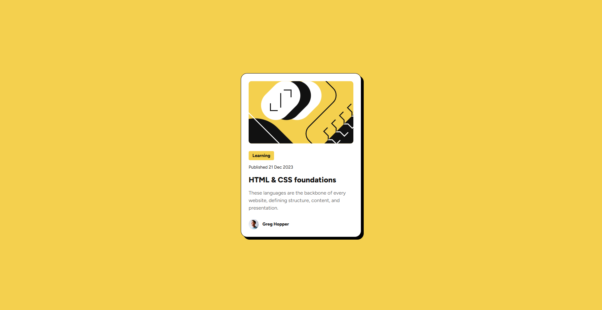

# Frontend Mentor - Blog preview card solution

This is a solution to the [Blog preview card challenge on Frontend Mentor](https://www.frontendmentor.io/challenges/blog-preview-card-ckPaj01IcS). Frontend Mentor challenges help you improve your coding skills by building realistic projects. 

## Table of contents

- [Overview](#overview)
  - [The challenge](#the-challenge)
  - [Screenshot](#screenshot)
  - [Links](#links)
  - [Built with](#built-with)
  - [What I learned](#what-i-learned)
  - [Continued development](#continued-development)
  - [AI Collaboration](#ai-collaboration)

**Note: Delete this note and update the table of contents based on what sections you keep.**

## Overview

### The challenge

Users should be able to:

- See hover and focus states for all interactive elements on the page

### Screenshot



### Links

- Solution URL: [https://github.com/mohsintahiri/Blog-Preview-Card](https://github.com/mohsintahiri/Blog-Preview-Card)
- Live Site URL: [https://blog-preview-card-delta-weld.vercel.app/](https://blog-preview-card-delta-weld.vercel.app/)

### Built with

- Semantic HTML5 markup
- CSS custom properties
- Flexbox

### What I learned

I learned how to add a custom font from your local files, its done for example like this:

```css
@font-face {
  font-family: 'Figtree';
  src: url('./assets/fonts/Figtree-VariableFont_wght.ttf') format('truetype');
}
```

### Continued development

I want to focus on specially starting developing designs faster and remembering some tags, because there are some which I forget.

### AI Collaboration

I didn't know how to add a font from a file so I asked Gemini, other than that I didn't no AI.